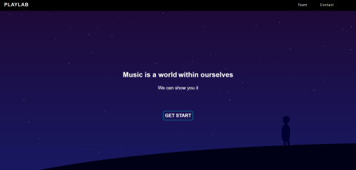
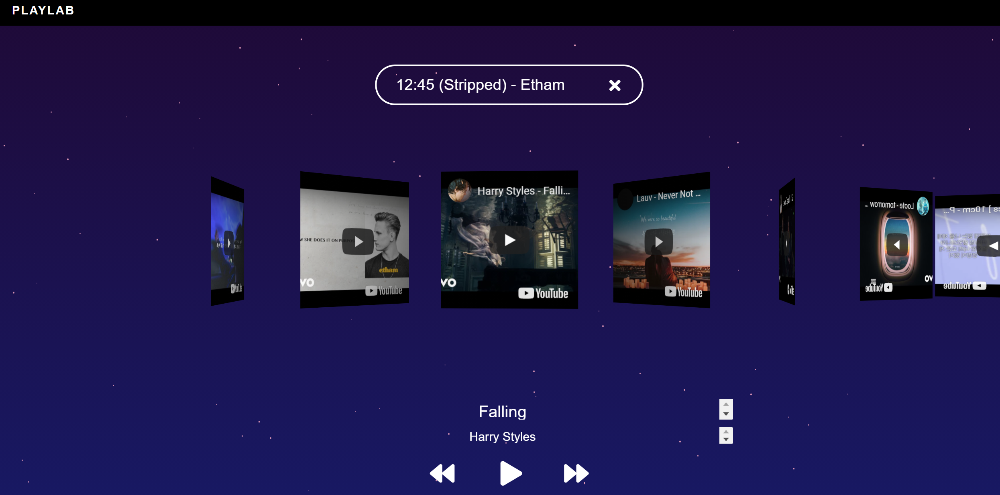

  
  
  <h1 align="center">PlayLab</h1>
  <h3 align="center">Recommend a song that suits your emotions</h3>
  <h3 align="center">
    <a href="https://playlabmusic.com/">Take recommendations now!</a>
  </h3>

## Summary

PlayLab은 'WordToVec' 을 응용한 'Song2Vec'의 모델을 사용해 플레이리스 기반의 음악 추천 사이트이다. 

    <a href="https://wikidocs.net/22660">Word2Vec 이란?</a>

모델에 관해 간단히 설명하자면 Word2Vec의 원-핫 인코딩을 통한 원-핫 벡터는 단어간 유사도를 계산 할수 있는데 예를 들어
'고양이 + 애교 = 강아지' 같이 고양이와 애교의 단어간의 유사도를 계산해 강아지라는 단어를 결과로 도출한다.

이것을 조금 응용해 멜론과 스포티파이에서 크롤링을 통해 얻은 플레이리스트에 담긴 음원 정보를 수집하고 
플레이리스트내에 있는 음악을 유사한 음악, 즉 단어라고 보고 해당 플레리스트로 라벨링을 하여 
음악들간의 유사도를 구해 노래를 추천하게 한다.

